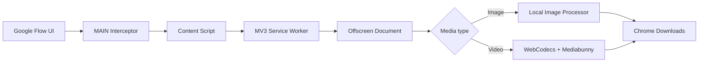

<div align="center">


# FlowZero

### Google Flow Image & Video Watermark Remover

**Tiện ích Chrome giúp tải và xử lý watermark của ảnh/video từ Google Flow ngay trong trình duyệt.**

[](https://github.com/Benb251/flow-zero-extension/releases/tag/v1.3.0-beta.1)


[**⬇️ Tải bản Beta mới nhất**](https://github.com/Benb251/flow-zero-extension/releases/tag/v1.3.0-beta.1)
&nbsp;•&nbsp;
[**📦 Tất cả Releases**](https://github.com/Benb251/flow-zero-extension/releases)

</div>

---

## ✨ Giới thiệu

**FlowZero** tích hợp trực tiếp vào giao diện **Google Flow (`labs.google`)**, cho phép chọn chất lượng và tải media với quy trình xử lý watermark tự động.

Ảnh và video được xử lý **cục bộ trong trình duyệt của người dùng**. FlowZero không cần máy chủ riêng để nhận và xử lý file media.

> [!IMPORTANT]
> FlowZero hiện đang ở giai đoạn **Beta**. Mục tiêu của `v1.3.0-beta.1` là kiểm thử độ ổn định trên nhiều cấu hình máy, GPU và phiên bản Chrome khác nhau trước khi phát hành stable.

## 🚀 Tính năng

- 🖼️ **Xử lý watermark ảnh** trực tiếp trong trình duyệt.
- 🎬 **Xử lý watermark video** bằng WebCodecs.
- 📐 Hỗ trợ luồng tải ảnh **1K / 2K** từ Google Flow.
- 🎞️ Tự động chọn đúng video **720p / 1080p** trong menu native của Google Flow.
- 🔊 **Giữ lại audio gốc** và đồng bộ âm thanh/video sau khi xử lý.
- ⚡ Tối ưu luồng video HTTP để giảm các bước chuyển đổi Base64 và giảm áp lực bộ nhớ.
- 🧩 Hỗ trợ media `blob:` với cơ chế fallback tương thích.
- 🪟 Xử lý media trong **Manifest V3 Offscreen Document**.
- 🧭 Tiến trình xử lý được gửi về **đúng tab khởi tạo tác vụ**.
- 🛡️ Ngăn FlowZero tự intercept lại chính file do extension tạo ra.
- 🔌 Khi tắt extension, FlowZero chuyển sang trạng thái **passive** và để Google Flow hoạt động bình thường.
- 💎 Giao diện chọn chất lượng dạng **glassmorphism** tích hợp trực tiếp trên media.
- 🔐 Tự động ẩn/hiện **4K** theo tier Google Flow mà extension phát hiện; khả năng tải 4K thực tế vẫn phụ thuộc gói tài khoản Google Flow.

## 📥 Cài đặt bản Beta

### Cách 1 — Tải từ GitHub Releases

1. Mở trang [**FlowZero v1.3.0 Beta 1**](https://github.com/Benb251/flow-zero-extension/releases/tag/v1.3.0-beta.1).
2. Tải file **`FlowZero-v1.3.0-beta.1.zip`**.
3. Giải nén ZIP ra một thư mục cố định.
4. Mở Chrome và truy cập:

   ```text
   chrome://extensions
   ```

5. Bật **Developer mode**.
6. Chọn **Load unpacked**.
7. Chọn thư mục FlowZero vừa giải nén — thư mục này phải chứa `manifest.json`.
8. Mở hoặc reload Google Flow.

### Cách 2 — Chạy trực tiếp từ source

```bash
git clone https://github.com/Benb251/flow-zero-extension.git
cd flow-zero-extension
```

Sau đó mở `chrome://extensions` → **Developer mode** → **Load unpacked** → chọn thư mục repository.

## 🧭 Cách sử dụng

1. Mở **Google Flow**.
2. Tạo hoặc mở ảnh/video cần tải.
3. Di chuột vào media để hiện nút **FlowZero**.
4. Chọn chất lượng phù hợp:
   - Ảnh: `1K`, `2K`, và `4K` khi tài khoản hỗ trợ.
   - Video: `720p` hoặc `1080p`.
5. FlowZero sẽ tự động điều khiển luồng tải native của Google Flow, intercept file và xử lý watermark.
6. File hoàn tất sẽ được tải về qua Chrome Downloads.

> [!NOTE]
> `4K` phụ thuộc entitlement/tier của tài khoản Google Flow. FlowZero không mở khóa các quyền chất lượng mà tài khoản không có.

## 🧠 Kiến trúc xử lý



### Các thành phần chính

| Thành phần | Vai trò |
|---|---|
| `scripts/content.js` | UI FlowZero, quality menu, automation và giao tiếp với trang |
| `scripts/interceptor.js` | MAIN-world interception, tier detection và bắt luồng download native |
| `scripts/background.js` | Điều phối Manifest V3, validation, Offscreen và Chrome Downloads |
| `scripts/offscreen.js` | Môi trường DOM nền để xử lý ảnh/video |
| `LocalGeminiWatermarkRemover.js` | Pipeline xử lý watermark ảnh |
| `lib/VideoWatermarkRemover.js` | Decode → process → encode → mux video |
| `lib/flowzero-utils.js` | URL validation, media detection và helper dùng chung |

## 🔒 Privacy & Security

FlowZero được thiết kế theo hướng **local-first**:

- Media không được upload lên máy chủ xử lý riêng của FlowZero.
- Quá trình xóa watermark diễn ra trong browser/offscreen context trên máy người dùng.
- URL media được kiểm tra trước khi chuyển vào pipeline xử lý.
- Host permissions được giới hạn cho Google Flow và các domain media Google cần thiết.
- Extension không yêu cầu tài khoản FlowZero riêng.

> FlowZero vẫn cần tải media từ các endpoint của Google Flow để xử lý file mà người dùng đã yêu cầu tải.

## 💻 Yêu cầu & tương thích

| Yêu cầu | Giá trị |
|---|---|
| Browser | Google Chrome **116+** |
| Extension platform | Manifest V3 |
| Website | Google Flow / `labs.google` |
| Video pipeline | WebCodecs |
| Recommended | Hardware acceleration bật |

Video có thể có khác biệt hiệu năng tùy **codec, GPU, driver, hardware acceleration và RAM** của từng máy.

## 🧪 Beta Testing

Nếu bạn đang tham gia Beta, vui lòng ưu tiên kiểm tra:

- Ảnh `1K`
- Ảnh `2K`
- Video `720p`
- Video `1080p`
- Audio sau khi xử lý video
- Bật/tắt FlowZero
- Reload Google Flow
- Chuyển tab trong lúc video đang xử lý
- Máy từng gặp tình trạng tải được file nhưng watermark không được xử lý

### Khi báo lỗi

Vui lòng cung cấp càng nhiều thông tin càng tốt:

```text
Chrome version:
OS:
CPU:
GPU:
RAM:
Hardware acceleration: ON/OFF
Media type: Image/Video
Resolution: 1K/2K/720p/1080p/4K
FlowZero version:
Console error:
Steps to reproduce:
```

Bạn có thể tạo issue tại [**GitHub Issues**](https://github.com/Benb251/flow-zero-extension/issues).

## 🛠️ Development

### Chạy test

Repository sử dụng Node.js built-in test runner:

```bash
npm test
```

### Cấu trúc repository

```text
flow-zero-extension/
├── assets/                 # Icons / extension assets
├── lib/                    # Media processing & shared utilities
├── popup/                  # Extension popup UI
├── scripts/                # Content, interceptor, background, offscreen
├── tests/                  # Regression tests
├── manifest.json           # Chrome MV3 manifest
├── package.json
└── README.md
```

## 📦 Release hiện tại

**Beta:** [`v1.3.0-beta.1`](https://github.com/Benb251/flow-zero-extension/releases/tag/v1.3.0-beta.1)

```text
FlowZero-v1.3.0-beta.1.zip
SHA256: FBB28E7439579DD2DB760ECADBAB2D71845D6AFD2DC6655F6252ED43F6A06F58
```

Xem toàn bộ lịch sử phát hành tại [**GitHub Releases**](https://github.com/Benb251/flow-zero-extension/releases).

## ⚠️ Disclaimer

FlowZero là dự án độc lập và **không liên kết, tài trợ hoặc được chứng thực bởi Google**.

Google, Google Chrome và Google Flow là nhãn hiệu/sản phẩm của chủ sở hữu tương ứng.

Hãy chỉ sử dụng FlowZero với nội dung mà bạn có quyền tải xuống, chỉnh sửa và sử dụng. Người dùng chịu trách nhiệm tuân thủ điều khoản dịch vụ và các quyền sở hữu trí tuệ áp dụng cho nội dung của mình.

---

<div align="center">

**FlowZero** — local-first media processing for Google Flow.

Nếu FlowZero hữu ích với bạn, hãy ⭐ repository để theo dõi các bản cập nhật mới.

</div>
