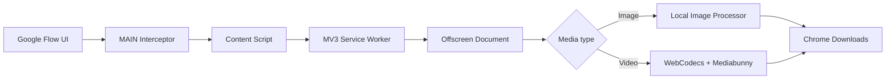

<div align="center">


# FlowZero

### Google Flow Image & Video Watermark Remover

**Tiện ích Chrome giúp tải và xử lý watermark của ảnh/video từ Google Flow ngay trong trình duyệt.**

[](https://github.com/Benb251/flow-zero-extension/releases/tag/v1.3.1)


[**🌐 Cài đặt trên Chrome Web Store**](https://chromewebstore.google.com/detail/flowzero-flow-watermark-r/odmhgbfkeficojickcohppoiiemgaiog?authuser=2&hl=vi)
&nbsp;•&nbsp;
[**⭐ Đánh giá FlowZero**](https://chromewebstore.google.com/detail/flowzero-flow-watermark-r/odmhgbfkeficojickcohppoiiemgaiog?authuser=2&hl=vi)
&nbsp;•&nbsp;
[**📦 GitHub Releases**](https://github.com/Benb251/flow-zero-extension/releases)

</div>

---

## ✨ Giới thiệu

**FlowZero** tích hợp trực tiếp vào giao diện **Google Flow (`labs.google`)**, cho phép chọn chất lượng và tải media với quy trình xử lý watermark tự động.

Ảnh và video được xử lý **cục bộ trong trình duyệt của người dùng**. FlowZero không cần máy chủ riêng để nhận và xử lý file media.

Phiên bản stable hiện tại của repository là **`v1.3.1`**.

## 🚀 Tính năng chính

- 🖼️ **Xử lý watermark ảnh** trực tiếp trong trình duyệt.
- 🎬 **Xử lý watermark video** bằng WebCodecs.
- 📐 Hỗ trợ luồng tải ảnh **1K / 2K**, và **4K** khi tài khoản Google Flow thực sự có capability tương ứng.
- 🎞️ Tự động chọn đúng video **720p / 1080p** trong menu native của Google Flow.
- 🔊 **Giữ lại audio gốc** khi video pipeline và codec hỗ trợ.
- ✨ Nút FlowZero được đặt trong khu vực action phía trên của media card để hòa hợp hơn với giao diện Google Flow.
- 🛡️ Download interception được giới hạn vào luồng xuất phát từ **Google Flow**, tránh ảnh hưởng tới download trên website khác.
- ⚡ Ưu tiên direct transport cho video HTTP để tránh Base64 round-trip và các memory copy không cần thiết.
- 🧩 Hỗ trợ media `blob:` và Data URL fallback khi cần.
- 🪟 Xử lý media nặng trong **Manifest V3 Offscreen Document**.
- 🧭 Progress/result được route về **đúng tab khởi tạo tác vụ**.
- 🔁 Ngăn FlowZero tự intercept lại chính file do extension tạo ra.
- 🔌 Khi tắt extension, FlowZero chuyển sang trạng thái **passive** và giữ nguyên hành vi native của Google Flow.

> [!NOTE]
> FlowZero không mở khóa hoặc giả lập entitlement. Các tùy chọn như `4K` chỉ khả dụng khi tài khoản Google Flow của người dùng thực sự có quyền tương ứng.

## 📥 Cài đặt

### Cách 1 — Chrome Web Store

Cách khuyến nghị cho người dùng thông thường:

👉 [**Cài đặt FlowZero trên Chrome Web Store**](https://chromewebstore.google.com/detail/flowzero-flow-watermark-r/odmhgbfkeficojickcohppoiiemgaiog?authuser=2&hl=vi)

Sau khi cài đặt, mở hoặc reload Google Flow để FlowZero được inject vào giao diện.

### Cách 2 — Chạy trực tiếp từ source

Dành cho development hoặc kiểm thử:

```bash
git clone https://github.com/Benb251/flow-zero-extension.git
cd flow-zero-extension
```

Sau đó mở `chrome://extensions` → bật **Developer mode** → **Load unpacked** → chọn thư mục repository.

## 🧭 Cách sử dụng

1. Mở **Google Flow**.
2. Tạo hoặc mở ảnh/video cần tải.
3. Di chuột vào media để hiện action **FlowZero**.
4. Chọn chất lượng phù hợp:
   - Ảnh: `1K`, `2K`, và `4K` khi tài khoản hỗ trợ.
   - Video: `720p` hoặc `1080p`.
5. FlowZero lấy media từ luồng download của Google Flow và xử lý watermark cục bộ.
6. File hoàn tất được lưu về máy thông qua Chrome Downloads.

## 🔮 Roadmap

Các hạng mục dưới đây đang ở trạng thái **research / benchmark / planned**. Chúng chưa được xem là capability production cho tới khi vượt qua validation và release gate.

- 🧠 **Watermark Detector thế hệ mới** — tăng độ bền khi logo thay đổi vị trí, kích thước hoặc độ tương phản.
- 🪄 **Nâng cấp chất lượng phục hồi ảnh** — tập trung bảo toàn texture, tóc, foliage, chữ và line-art tốt hơn sau khi xử lý.
- 🎯 **Hybrid Watermark Removal** — kết hợp detection confidence, reverse-alpha reconstruction và fallback có kiểm soát thay vì dùng một repair strategy cho mọi ảnh.
- 🛟 **Failure-safe Download** — giữ/resume file gốc khi không phát hiện watermark hoặc processing không đạt quality gate, chỉ thay thế download khi kết quả cleaned được xác nhận.
- 🎬 **Video watermark detection** — nghiên cứu pre-detection để tránh chỉnh sửa ROI không cần thiết trên video không có watermark.
- 🧪 **Fixture-based regression benchmark** — mở rộng test từ helper/unit sang bộ ảnh Flow thật và hard-negative cases để giảm false-positive.

## 🧠 Kiến trúc xử lý



### Các thành phần chính

| Thành phần | Vai trò |
|---|---|
| `scripts/content.js` | Flow UI integration, quality menu, automation và user feedback |
| `scripts/interceptor.js` | MAIN-world interception và quan sát native Flow download/tier signals |
| `scripts/background.js` | Validation, orchestration, Offscreen lifecycle và Chrome Downloads boundary |
| `scripts/offscreen.js` | DOM/media execution context cho image/video processing |
| `lib/LocalGeminiWatermarkRemover.js` | Pipeline xử lý watermark ảnh |
| `lib/VideoWatermarkRemover.js` | Decode → process → encode → mux video |
| `lib/flowzero-utils.js` | URL/media/filename validation và helper dùng chung |

## 🔒 Privacy & Security

FlowZero được thiết kế theo hướng **local-first**:

- Media không được upload lên máy chủ xử lý riêng của FlowZero.
- Quá trình xử lý watermark diễn ra trong browser/offscreen context trên máy người dùng.
- Remote media phải vượt qua trusted-source validation trước khi đi vào processing pipeline.
- Host permissions được giới hạn cho Google Flow và các domain media Google cần thiết.
- Extension không yêu cầu tài khoản FlowZero riêng.
- Khi extension OFF, FlowZero không được can thiệp vào native download behavior.

> FlowZero vẫn cần tải media từ các endpoint Google mà Google Flow sử dụng để phục vụ chính file người dùng yêu cầu tải.

## 💻 Yêu cầu & tương thích

| Yêu cầu | Giá trị |
|---|---|
| Browser | Google Chrome **116+** |
| Extension platform | Manifest V3 |
| Website | Google Flow / `labs.google` |
| Video pipeline | WebCodecs |
| Recommended | Hardware acceleration bật |

Hiệu năng video có thể khác nhau tùy **codec, GPU, driver, hardware acceleration và RAM** của từng máy.

## 🐞 Feedback & báo lỗi

Nếu gặp lỗi, vui lòng cung cấp càng nhiều thông tin càng tốt:

```text
Chrome version:
OS:
CPU:
GPU:
RAM:
Hardware acceleration: ON/OFF
Media type: Image/Video
Resolution: 1K/2K/4K/720p/1080p
FlowZero version:
Console error:
Steps to reproduce:
```

Bạn có thể tạo issue tại [**GitHub Issues**](https://github.com/Benb251/flow-zero-extension/issues).

Nếu FlowZero hữu ích với bạn, một lượt đánh giá trên Chrome Web Store sẽ giúp dự án có thêm feedback để ưu tiên các bản cập nhật tiếp theo:

👉 [**⭐ Đánh giá FlowZero trên Chrome Web Store**](https://chromewebstore.google.com/detail/flowzero-flow-watermark-r/odmhgbfkeficojickcohppoiiemgaiog?authuser=2&hl=vi)

## 🛠️ Development

### Chạy test

Repository sử dụng Node.js built-in test runner:

```bash
npm test
```

### Build Chrome Web Store package

```bash
npm run package
```

### Cấu trúc repository

```text
flow-zero-extension/
├── assets/                 # Icons / extension assets
├── lib/                    # Media processing & shared utilities
├── popup/                  # Extension popup UI
├── scripts/                # Content, interceptor, background, offscreen
├── tests/                  # Regression tests
├── manifest.json           # Chrome MV3 manifest
├── package.json
└── README.md
```

## 📦 Release hiện tại

**Stable:** [`v1.3.1`](https://github.com/Benb251/flow-zero-extension/releases/tag/v1.3.1)

Release asset:

```text
FlowZero-ChromeWebStore-v1.3.1.zip
SHA256: 9B36DAE6C4613443D26CDCB9A2C782ECCC38523DF75386268C3318158B87E56C
```

Xem toàn bộ lịch sử phát hành tại [**GitHub Releases**](https://github.com/Benb251/flow-zero-extension/releases).

## ⚠️ Disclaimer

FlowZero là dự án độc lập và **không liên kết, tài trợ hoặc được chứng thực bởi Google**.

Google, Google Chrome và Google Flow là nhãn hiệu/sản phẩm của chủ sở hữu tương ứng.

Hãy chỉ sử dụng FlowZero với nội dung mà bạn có quyền tải xuống, chỉnh sửa và sử dụng. Người dùng chịu trách nhiệm tuân thủ điều khoản dịch vụ và các quyền sở hữu trí tuệ áp dụng cho nội dung của mình.

---

<div align="center">

**FlowZero** — local-first media processing for Google Flow.

[**🌐 Chrome Web Store**](https://chromewebstore.google.com/detail/flowzero-flow-watermark-r/odmhgbfkeficojickcohppoiiemgaiog?authuser=2&hl=vi)
&nbsp;•&nbsp;
[**⭐ Đánh giá tiện ích**](https://chromewebstore.google.com/detail/flowzero-flow-watermark-r/odmhgbfkeficojickcohppoiiemgaiog?authuser=2&hl=vi)
&nbsp;•&nbsp;
[**🐞 Báo lỗi**](https://github.com/Benb251/flow-zero-extension/issues)

</div>
